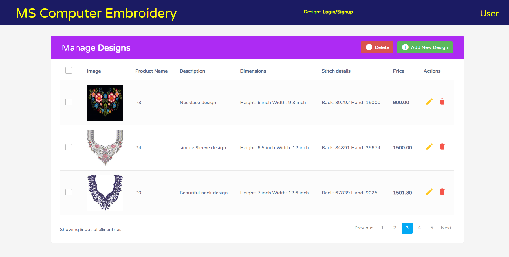
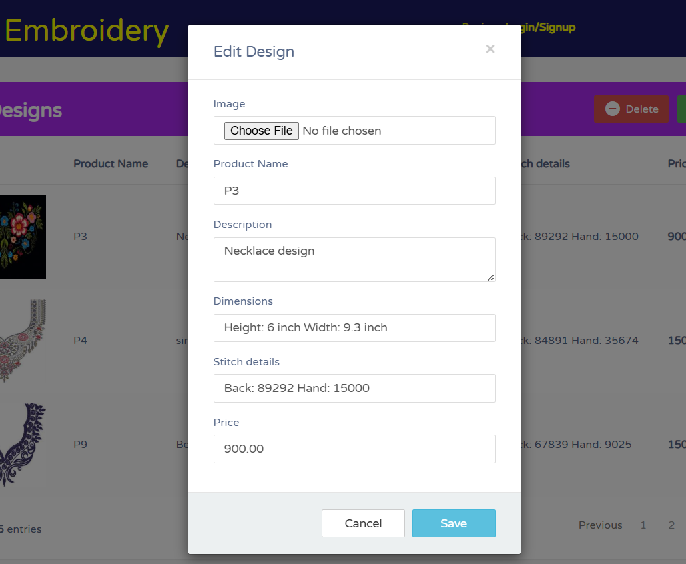

# 🧵 Design Collection Website

A **Django-based embroidery design management system** built for **SUMA Computer Embroidery**, enabling efficient handling of 500+ design assets with full CRUD functionality, user roles, and analytics dashboards.

---

## 🚀 Overview

The **Design Collection Website** is a full-stack web application designed to streamline the management of embroidery designs.  
It allows users and admins to upload, browse, update, and analyze embroidery design data with ease.

**Key Highlights:**
- 🔧 Full CRUD operations for design entries  
- 👤 Role-based user access (Admin / Staff / Viewer)  
- 📊 Analytics dashboard for design insights  
- 💾 Optimized SQL workflows for **30% faster query responses**  
- 🎨 Clean and intuitive UI for managing design collections  

---

## 🏗️ Tech Stack

| Layer | Technology |
|-------|-------------|
| **Backend** | Django (Python) |
| **Frontend** | HTML, CSS, Bootstrap |
| **Database** | SQLite (Relational DB) |
| **Architecture** | Django MVT (Model-View-Template) |
| **Deployment** | Django Server / Localhost / Cloud-ready |

---

## ⚙️ Features

- **CRUD Operations:**  
  Create, Read, Update, and Delete embroidery designs with ease.
  
- **User Roles & Authentication:**  
  Secure access for admins and users with Django’s built-in auth system.
  
- **Analytics Dashboard:**  
  Visual insights into total designs, categories, and design upload trends.
  
- **Search & Filters:**  
  Find designs quickly by name, category, or date.
  
- **Admin Panel Customization:**  
  Tailored backend interface for efficient operations.
  
- **Optimized SQL Queries:**  
  Achieved **30% faster data retrieval** using indexed queries and optimized models.

---

## 🧩 Database Schema

| Field | Type | Description |
|-------|------|-------------|
| `image` | ImageField | Preview image of the embroidery design |
| `product_name` | CharField | Name or title of the embroidery design |
| `description` | TextField | Detailed description of the design |
| `dimensions` | CharField | Physical size or area of the design |
| `stitch_details` | CharField | Thread or stitch count info |
| `price` | DecimalField | Price of the design |

---

## Screenshots

| Home Page |   | Edit/Add Form |
|------------|---|---------------|
|  |   |  |

---

## Tech Stack
 Python • Django • HTML • CSS • Javascript
